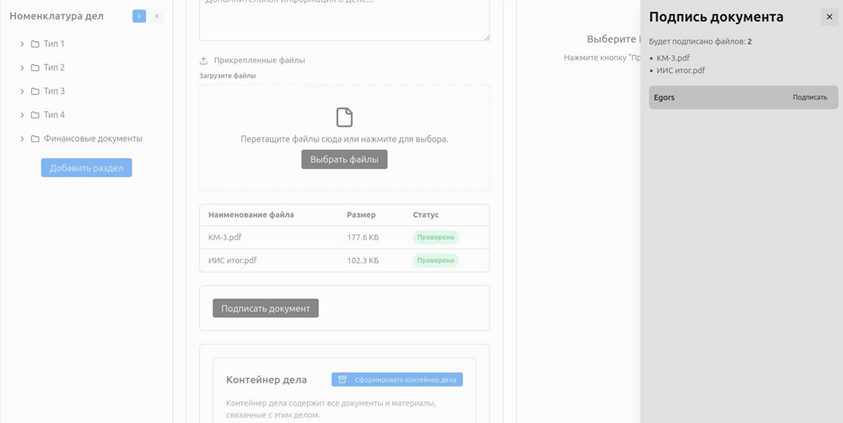
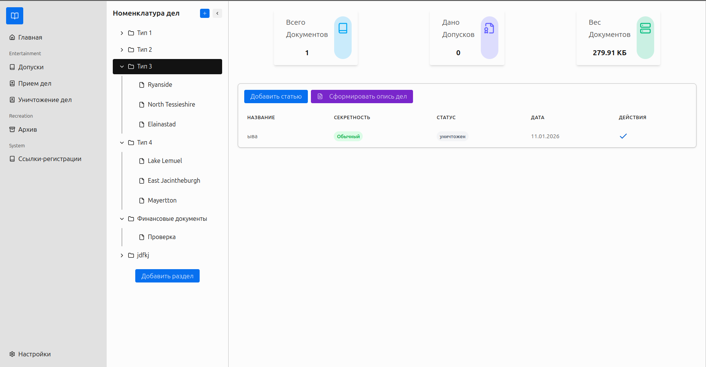
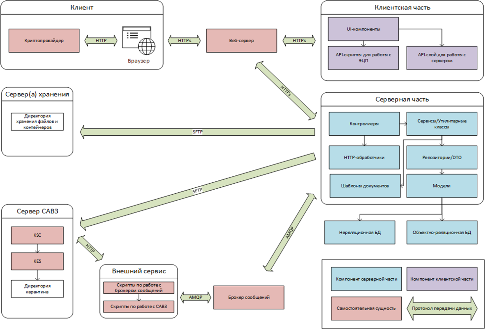

## Artual
Приложение для хранения документов в соответствии с приказами Росархива №77

## Скриншоты

## Схема проекта

## Функционал
1. Аутентификация по БД или LDAP-серверу
2. Инвайт-ссылки для регистрации пользователей (в случае БД аутентификации)
3. Уничтожение устаревших документов через акты и пометка в записи дела об уничтожении документов
4. Передача документов через акты и пометка в записи дела об передачи документов
5. Проверка файлов через Kaspersky Endpoint Security после прикрепления документов в дело (с отображением статуса проверки файлов в деле)
6. Электронная подпись документов и формирование документов в контейнер
## Стек

* **Frontend:** SvelteKit, Svelte 5, Skeleton UI
* **Backend:** Laravel 11
* **DB:** PostgreSQL 16, Redis, OpenLDAP
* **Broker:** RabbitMQ
* **Infrastructure:** Nginx (reverse proxy), Docker
* **CryptoAPI:** [crypto-pro-cadesplugin](https://github.com/bad4iz/crypto-pro-cadesplugin)

## Планы
- [x] Настроить nginx
- [x] Настроить redis
- [x] Установка пакета predis на бэк
- [x] Настроить брокер сообщений
- [x] Настроить Laravel Sanctum
- [x] Репозитории для работы с БД
- [x] Очереди для работы с брокером
- [x] Базовые модели по работе с документами и директориями
- [x] Сервис по работе с auth через БД или LDAP (настройка через конфиг)
- [x] Сервис по работе с Redis
- [x] Сервис по работе с инвайт-ссылками (хранение в кластере Redis)
- [ ] Конфигурация подключения модулей через страницу настроек
- [ ] Авторизация через ЕСИА
- [x] Сервис на golang по работе с Kaspersky Security Center (OpenAPI)
- [x] Установить SvelteKit и отключить SSR (фронт сборка)